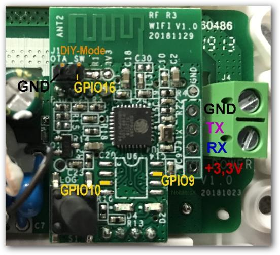

# Sonoff Basic switch with MQTT and Thingsboard
Sonoff Basic Switch Arduino source code over MQTT using [ThingsBoard](https://thingsboard.io/) (Has implemented by reverse engineering the switch functionality)

## Contents
1. Sonoff Basic
2. Flashing
3. Requirements

#### Sonoff Basic
SONOFF BASICR is a cost effective WiFi wireless smart switch that lets you automate or remotely control lighting and appliances.

#### Flashing
For flashing the Sonoff Basic, hold the button while connecting the 3.3V power. The LED remains off until the flashing process is done and the board is rebooted.
For more information read instruction from [tasmota](https://tasmota.github.io/docs/devices/Sonoff-Basic/#serial-flashing) carefully.

#### Requirements
Open Arduino IDE and go to Sketch -> Include Library -> Manage Libraries. Find and install the following libraries:

1. [PubSubClient 2.6 by Nick O’Leary](http://pubsubclient.knolleary.net/)
2. [ArduinoJson 5.8.0 by Benoit Blanchon](https://github.com/bblanchon/ArduinoJson)

Happy coding!!!
